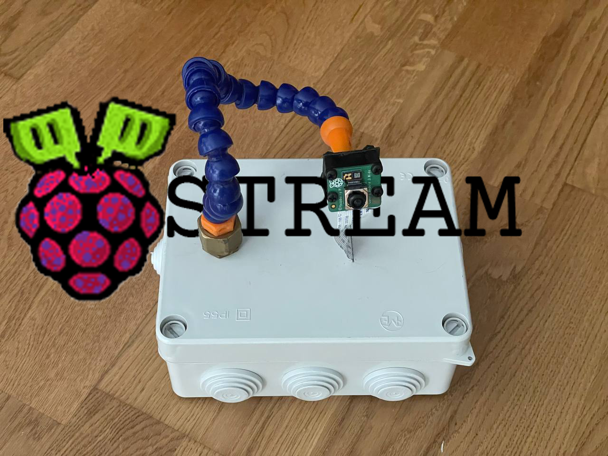
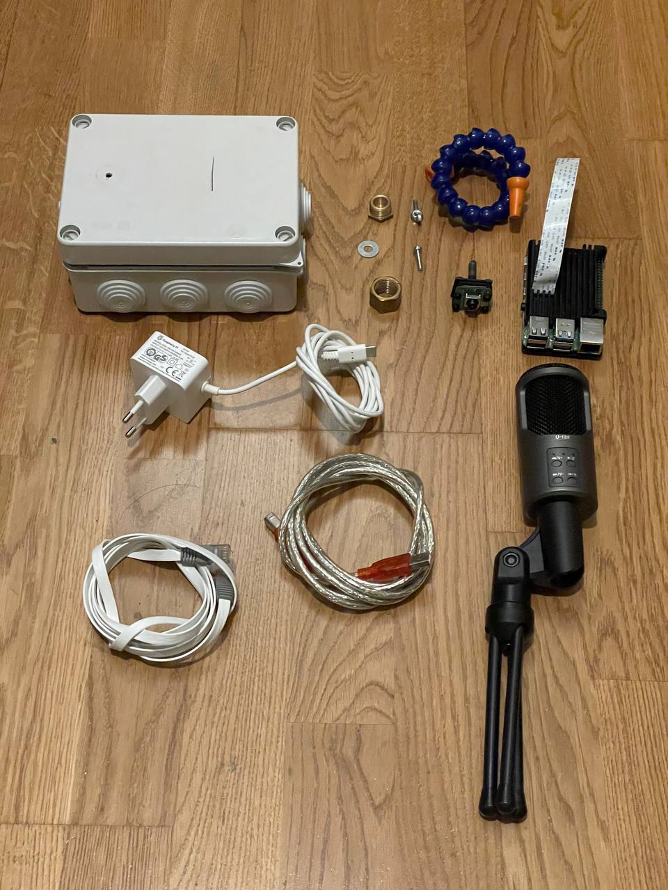
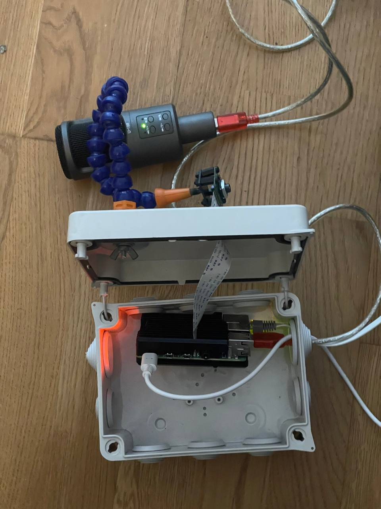

<p align="center">
  
</p>

# RaspyStream
This is a simple-to-use tool to stream on Twitch or other streaming services from a Raspberry Pi and the new camera module v3. There are a lot of projects like this online the problem is that most of them use the old Raspivid which is not supported anymore, that's why I created this project adapting old programs to the new Libcam library.
You can check a step-by-step gide on mi instructables <a href="https://www.instructables.com/RaspyStream/">RaspiStream </a>

  
# Info
This project consists of 3 scripts made for streaming without audio, with music, and with a microphone all from the Raspberry Pi, there is also a script name ScreenIt.sh that will run the stream in a screen session.

# Key-features
- 1080p 30fps Stream.
- HDR option.
- Autofocus.
- Microphone, music playlist, or blank audio options.
- Bitrate adjustable for compromise bandwidth 

# Instructions 
Modify the keys.txt with the URL and private key from twitch, then you can use the ScreenIt.sh script to run it in a screen session or just use any of the RaspyStream*.sh 
Modify the keys.txt with the URL and private key from twitch, then you can use the ScreenIt.sh script to run it in a screen session or just use any of the RaspyStream*.sh, all the files are documented so you can change parameter like the resolution, the HDR or the bitrate easyli.

- RaspyStreamMusic.sh: This script plays .wav files in the Music folder to run it first upload all your wav files to the folder Music then modify the file Playlist.txt and write the name of your files just like the example songs. It will be played in the order and you can repeat the files, once it finishes all it will start again, note that the default songs are blank.
- RaspyStreamMic.sh: This script is for conecting a microphone, you will need to edit the script in line 62 where is says "InputA=3,0" change it to what the comand gives you back in the "card:" and "device:". For the example bellow you wil have to write : "InputA=3,0"
```
pi@RaspyStream:~/RaspyStream-main $ arecord -l
**** List of CAPTURE Hardware Devices ****
card 3: U188 [U-188], device 0: USB Audio [USB Audio]
  Subdevices: 1/1
  Subdevice #0: subdevice #0
```
you wil have to write : "InputA=3,0" 

# Contact
I will be happy to discuss the proyect or any questions here or in my socials

diegozalezz@gmail.com
diego@abyteofthat.com
Instagram <a href="https://www.instagram.com/abyteofthat/">@abyteofthat</a>

